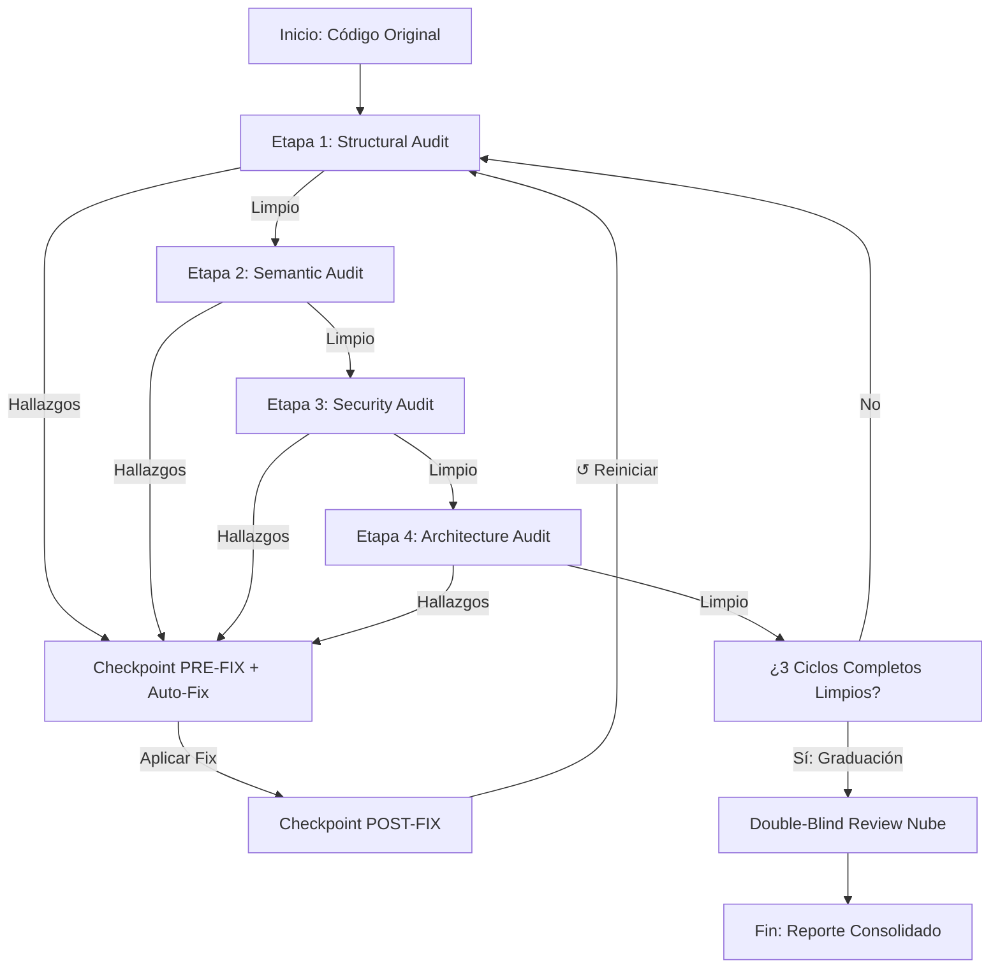

## Context & Triggers
**When to use this skill:**
- Trigger: <describe_when_to_use>


## Execution Phases


**DRY-RUN RULE:** Before executing any destructive or external operation, first perform a dry-run to preview what will happen. Show the user what actions would be taken, then ask for confirmation before proceeding.
### 1. Preparation Phase
- Load references and verify prerequisites
- Resolve target scope

### 2. Action Phase
- Execute the main workflow (original content below preserves existing steps)

### 3. Verification Phase
- Verify output matches expected results

# Skill: Local Auditor (Auditor Técnico Secuencial Local)

Un auditor de calidad y seguridad local que opera sobre modelos de inferencia locales (e.g. LM Studio / Local LLM Server) mediante ciclos iterativos y correcciones automáticas de código (auto-fix) con control de versiones integrado.

---

## 🧭 Flujo Operativo (Coarse-to-Fine)

El auditor ejecuta un proceso secuencial de 4 etapas ordenadas de lo estructural a lo abstracto:



---

## 🛠️ Modos de Control y Resiliencia

### 1. Control de Versiones Integrado (Git Checkpoints)
- **PRE-FIX**: Cuando una etapa detecta hallazgos, el auditor realiza un commit exclusivo del archivo afectado con el mensaje `pre-fix: local-auditor [STAGE] checkpoint for [FILE]`. Esto permite volver atrás ante cualquier regresión destructiva.
- **POST-FIX**: Una vez que el modelo local aplica la refactorización correctiva, se realiza un nuevo commit con el mensaje `fix: local-auditor [STAGE] auto-applied fixes for [FILE]`.
- **Fallback Físico**: Si el entorno no utiliza Git o el archivo no pertenece a un repositorio, el auditor crea copias físicas incrementales con extensión `.bak` dentro del directorio `d:/Engram_SDD/scratch/`.

### 2. Guardas de Conversencia
Para evitar bucles infinitos en caso de que un modelo local no logre resolver un problema, cada etapa cuenta con un límite de intentos ajustables (`--max-attempts`, por defecto 3). Si se excede, el auditor interrumpe con un `ConvergenceError` reportando detalladamente los hallazgos no resueltos para intervención manual.

---

## 🚀 Uso desde Línea de Comandos

Puedes ejecutar el auditor directamente utilizando `node`:

```bash
node skills/local-auditor/scripts/main.js --target <ruta_archivo> [opciones]
```

### Opciones Disponibles
- `--target` | `-t` (Requerido): Ruta absoluta o relativa al archivo que se desea auditar.
- `--local-url`: URL base del servidor de inferencia compatible con OpenAI (ej: `http://localhost:1234/v1`). Por defecto lee `process.env.LOCAL_LLM_URL` o `http://localhost:1234/v1`.
- `--local-model`: Nombre del modelo local configurado (ej: `llama-3-8b`). Por defecto lee `process.env.LOCAL_MODEL` o `llama-3-8b`.
- `--max-attempts`: Cantidad máxima de reintentos de auto-fix por etapa (por defecto `3`).
- `--criteria`: Criterios técnicos o de negocio adicionales inyectados dinámicamente al auditor (opcional).

---

## 📊 Reporte Técnico

Al finalizar, el auditor escribe un reporte técnico exhaustivo en Markdown ubicado en:
`d:/Engram_SDD/scratch/local_audit_report_<basename_archivo>.md`

El reporte incluye:
1. **Resumen Ejecutivo**: Tiempos de ejecución, tokens consumidos, velocidad media (TPS) y estado final.
2. **Intentos de Auto-Fix**: Reintentos consumidos por etapa.
3. **Historial de Hallazgos**: Tabla detallando el bucle, etapa, hallazgos específicos corregidos, y hashes de checkpoints de Git.
4. **Telemetría**: Tiempos de respuesta y métricas de tokens por cada llamada al LLM.
5. **Graduación**: Reporte consolidado de la revisión adversarial en la nube (Double-Blind Review).

## Guardrails (Critical Rules)
- **NEVER** execute destructive operations without explicit user confirmation
- **ALWAYS** verify target exists before operating

